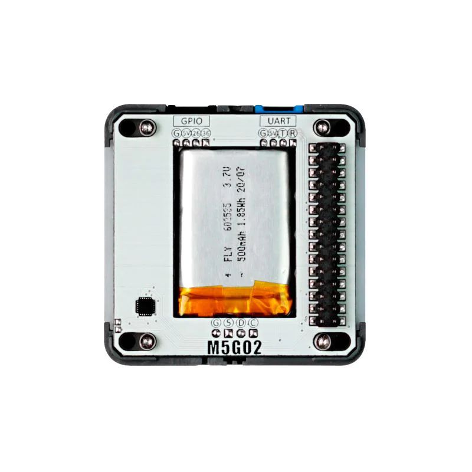

# M5GO BOTTOM2

# **Description**

M5GO BOTTOM2 is an expansion base designed for M5Core2. It integrates an MPU6886 6 axis gyro/accelerometer,digital mic(SPM1423) and 500mAh LiPo battery. The base also includes 2 HY2.0-4P expansion ports capable of ADC/DAC/UART protocols and data input/output,which allows the use of units from the M5Stack range. On either side of the base beneath a diffuser are a total of 10 programmable RGB LEDs(SK6812),which can be used as a form of notification or for impressive lighting effects. Beneath the device are a set of pogo pins which can attach to a charging base (excluded) for charging. The pogo pin connector can also be used for I2C communication, therefore if the user wants to attach or modify the base to include I2C devices they are able to do so. On the bottom of the device are an array of Lego™ compatible holes which makes integration of your Lego™ projects a breeze.

## Specifications

| Resources | Parameter |
| --- | --- |
| Mic | SPM1423 | 
| LED | SK6812*10 | 
| IMU | MPU6886 | 
| Net Weight | 31g | 
| Gross Weight | 45g | 
| Product Dimensions | 54548mm | 
| Packaging Dimensions | 605717mm | 