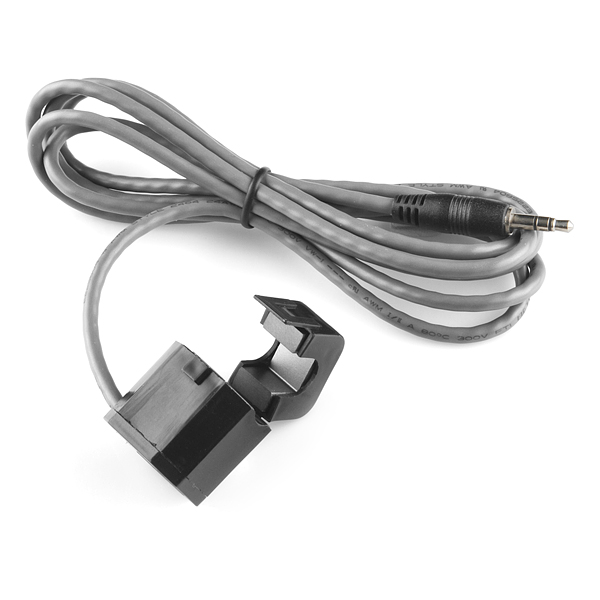

# ENV III

# **Description**

This non-invasive current sensor (also known as a "split core current transformer") can be clamped around the supply line of an electrical load to tell you how much current is passing through it. It does this by acting as an inductor and responding to the magnetic field around a current-carrying conductor. By reading the amount of current being produced by the coil, you can calculate how much current is passing through the conductor.

This particular current sensor will measure a load up to 30 Amps which makes it great for building your own energy monitor to keep your power usage down, or even building an over-current protection device for an AC load. This sensor does not have a load resistor built in, so in most cases it will be necessary to place a resistor across the output to convert the coil's induced current to a very small measurable voltage.

The sensor can be read using an ADC converter.

## Specifications

| Resources | Parameter |
| --- | --- |
| Rated Primary Current(Amp.) | 50/60Hz 30nom(1~60A max) |
| Turnn ratio | Np:Ns=1:2000 |
| Current Ratio | 30A/15mA |
| D.C.Resistance at 20 ℃ | 250 Ω |
| Accuracy @RL≦10Ω | 2% |
| Linearity @RL≦10Ω | 0.5% |
| Phase error at rated current range | ≦4˚ |
| Operating Temperature Range | -40~65℃ |
| Storage Temperature Range | -45~85℃ |
| Dielectric Withstanding Voltage(Hi-pot) | 2.5KV/1mA/1min |
| Insulation Resistance | DC500V/100MΩ min |