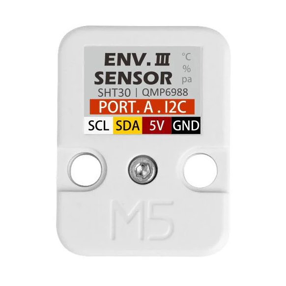

# ENV III

# **Description**

ENV III is an environmental sensor that integrates SHT30 and QMP6988 internally to detect temperature, humidity, and atmospheric pressure data. The ENV III data is accesible through I2C.

## Specifications

| Resources | Parameter |
| --- | --- |
| Maximum temperature measurement range | -40 ~ 120 ℃ |
| Highest measurement accuracy | 0 ~ 60 ℃/±0.2℃ |
| Humidity measurement range/error | 10 ~ 90 %RH / ±2% |
| Maximum measured value of air pressure/resolution/error | 300 ~ 1100hPa / 0.06Pa / ±3.9Pa |
| Communication protocol | I2C: SHT30(0x44), QMP6988(0x70) |
| Working temperature | 32°F to 104°F (0°C to 40°C ) |